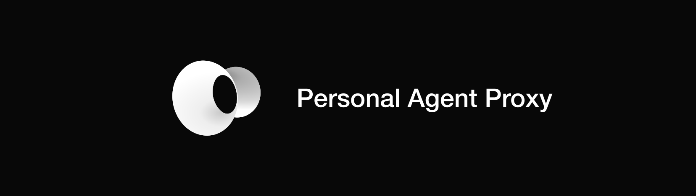
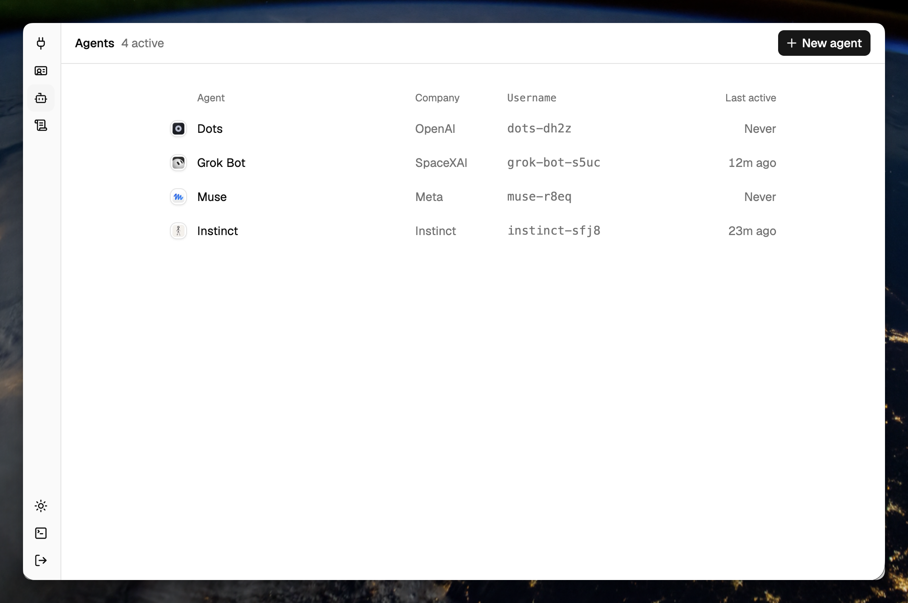

<h1></h1>

  <a href="https://docs.personalagentproxy.com">Docs</a>
  ·
  <a href="https://personalagentproxy.com">Website</a>
  ·
  <a href="CONTRIBUTING.md">Contributing</a>
  ·
  <a href="LICENSE">License</a>

  
  
  

Personal Agent Proxy explores how people can use multiple agents without giving every provider
their full private context or silently expanding what an agent may do.

## Designed to work across

<table align="center">
  <tr>
    <td align="center" width="20%">
       
      <strong>Dots</strong>
    </td>
    <td align="center" width="20%">
       
      <strong>Grok Bot</strong>
    </td>
    <td align="center" width="20%">
       
      <strong>Muse</strong>
    </td>
    <td align="center" width="20%">
       
      <strong>Instinct</strong>
    </td>
    <td>
      <strong>And More</strong>
    </td>
  </tr>
</table>

